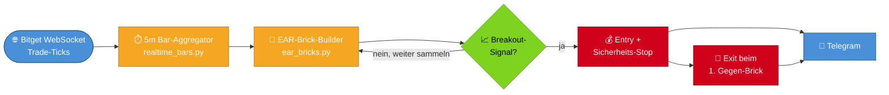
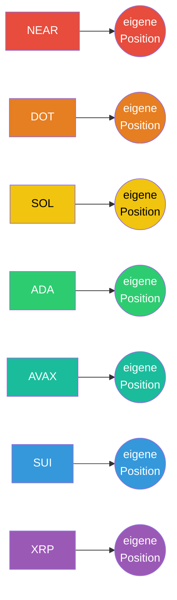
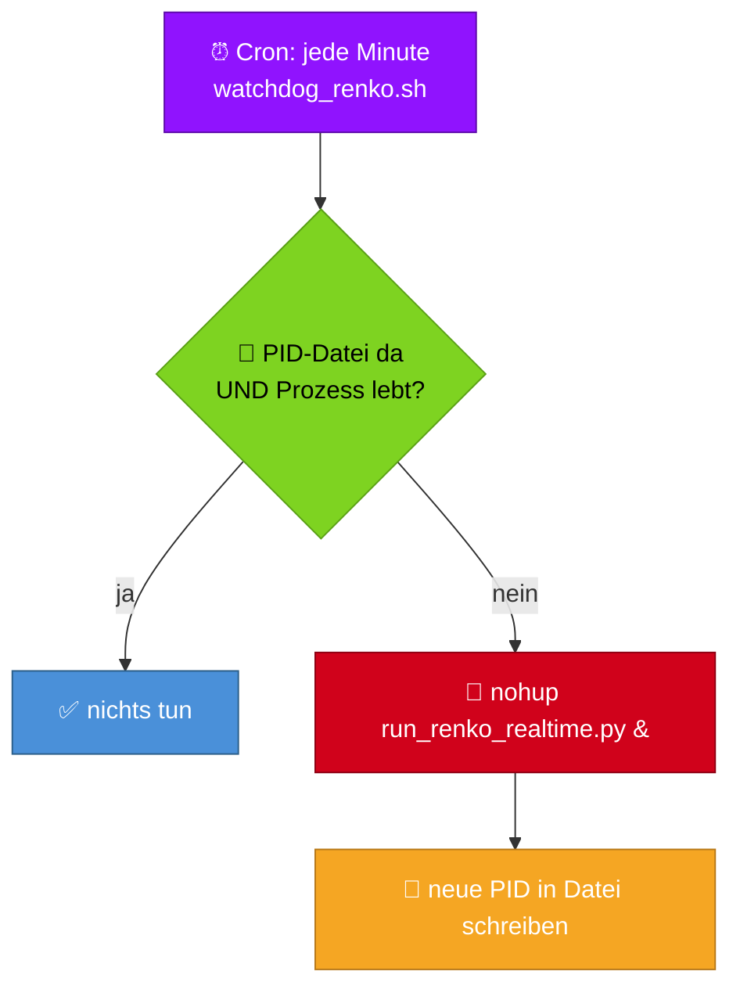

# oraclebot — Portfolio-Renko-Breakout-Strategie


## Grundidee

Portfolio-weite Renko-Breakout-Strategie auf sieben Altcoins (NEAR, DOT, SOL, ADA, AVAX, SUI,
XRP). Baut Entropy-Adaptive-Renko-Bricks (EAR, portiert aus `zerobot`) — Bricks entstehen
preisbasiert, nicht zeitbasiert, Brick-Größe passt sich dynamisch an die aktuelle Marktentropie
an. Kein Vorhersage-Modell:

- **Entry**: ein Ausbruch aus einer Seitwärtsphase — `breakout_run` Bricks am Stück in dieselbe
  Richtung, direkt nach `horizontal_lookback` Bricks gemischter Richtung davor.
- **Exit**: der erste vollständig ausgebildete Gegen-Brick. Kein festes Take-Profit — die
  Brick-Struktur selbst definiert das Ende des Trades.
- **Mehrfach-Positionen**: jedes der 7 Coins handelt komplett UNABHÄNGIG (seit 2026-09-25, siehe
  unten) — kein gemeinsamer Slot, keine Arbitrierung zwischen Symbolen mehr.
- **Positionsgröße**: Anti-Martingale (Paroli), EIN gemeinsamer Streak über alle Symbole —
  Einsatz wächst nach Gewinnserien (unabhängig welches Symbol gewinnt), fällt sofort auf die
  Basis zurück nach jedem Verlust.

Validiert über 70/30 In-Sample/Out-of-Sample-Split, mit realistischen Kosten (Taker-Gebühren,
Slippage, echte Bitget-Funding-Historie) und einer Liquidationsprüfung anhand der tatsächlichen
5m-Kursbewegung (nicht nur der Brick-Schlusskurse) gegen die echten, symbolspezifischen
Bitget-Wartungsmargen.

**Läuft live in Echtzeit (WebSocket), nicht mehr per Cron-Polling** — siehe
["Warum Echtzeit-Ausführung"](#warum-echtzeit-ausführung-statt-cron-polling) unten. Das war keine
Optimierung, sondern die Voraussetzung dafür, dass die Strategie überhaupt eine Edge hat.

### 🧱 Anatomie eines Trades

```
Seitwärtsphase (horizontal_lookback = 6 gemischte Bricks)      Breakout        Haltephase           Exit
        🟩 🟥 🟩 🟩 🟥 🟥            →       🟩 🟩       →     (bis Gegen-Brick)  →      🟥
                                        breakout_run = 2                              1. Gegen-Brick
                                        ENTRY 🚀 LONG                                 EXIT 🏁
```

Keine Vorhersage, kein Take-Profit-Ziel — der Chart selbst sagt, wann rein und wann raus.

---

## 📋 Befehlsübersicht (Cheat Sheet)

Alle Pfade relativ zum `oraclebot`-Wurzelverzeichnis. Auf dem VPS mit `.venv/bin/python3`.

**🛠️ Setup**
| Befehl | Zweck |
|---|---|
| `bash ./install.sh` | Venv anlegen, Requirements installieren, Root-Skripte ausführbar machen |
| `cp secret.json.example secret.json && nano secret.json` | API-Keys + Telegram konfigurieren |

**🧪 Tests & Verifikation**
| Befehl | Zweck |
|---|---|
| `./run_tests.sh` | Komplette Testsuite, venv-sicher (empfohlen) |
| `.venv/bin/python3 scripts/run_renko_realtime.py --dry-run` | Echte WebSocket-Daten + Signal-Logik live beobachten, **keine Orders** |

**▶️ Live-Betrieb steuern**
| Befehl | Zweck |
|---|---|
| `crontab -e` → `* * * * * .../scripts/watchdog_renko.sh` | Dauerbetrieb einrichten (Standard-Deployment) |
| `.venv/bin/python3 scripts/run_renko_realtime.py` | Manuell im Vordergrund starten (nur zum Debuggen) |
| `kill $(cat artifacts/state/renko_realtime.pid)` | Prozess beenden — der Watchdog startet ihn danach automatisch neu! |
| Cronjob-Zeile entfernen **+** `kill $(cat artifacts/state/renko_realtime.pid)` | Bot **vollständig** stoppen |
| `enabled: false` in `settings.json` + `git push` + `./update.sh` | Soft-Pause: keine neuen Entries, offene Position(en) laufen bis Exit weiter |

**📊 Zustand & Monitoring**
| Befehl | Zweck |
|---|---|
| `tail -f logs/cron_renko.log` | Live-Log mitverfolgen |
| `grep -i "ERROR" logs/cron_renko.log` | Fehler im Log finden |
| `ps aux \| grep run_renko_realtime` | Läuft der Prozess? |
| `cat artifacts/state/renko_realtime.pid` | Vom Watchdog überwachte PID |
| `cat artifacts/state/renko_realtime_positions.json` | Aktuell offene Position(en) je Symbol (mehrere gleichzeitig möglich) |
| `cat artifacts/state/renko_realtime_anti_martingale.json` | Aktueller Einsatz-Prozentsatz |
| `crontab -l` | Cronjobs anzeigen |

**🎨 Illustration**
| Befehl | Zweck |
|---|---|
| siehe [Illustration eines Trades](#illustration-eines-trades-ansehen) | Interaktive Plotly-HTML-Chart eines Trades erzeugen |

**🔄 Update & Deployment**
| Befehl | Zweck |
|---|---|
| `./update.sh` | Neueste Version ziehen (sichert & stellt `secret.json` wieder her) |
| `git remote set-url origin git@github.com:Youra82/oraclebot.git` | HTTPS → SSH umstellen (behebt Passwort-Abfrage bei `update.sh`) |
| `ssh -T git@github.com` | SSH-Key-Verbindung zu GitHub testen |

---

## Architektur

```
scripts/
├── run_renko_realtime.py              AKTUELLER Live-Prozess: dauerhaft laufend, WebSocket-getrieben
├── watchdog_renko.sh                  Cron-Wächter: startet run_renko_realtime.py neu, falls er nicht läuft
└── run_renko_breakout.py              LEGACY: 5-Minuten-Cron-Variante, nicht mehr im Live-Einsatz
                                        (siehe Abschnitt zur Ausführungs-Verzögerung) -- Code bleibt
                                        als Referenz/für Backtests erhalten, wird nicht mehr deployt
src/oraclebot/
├── data/ear_bricks.py                 EAR-Brick-Konstruktion (Shannon-Entropie, inkrementell fortsetzbar)
├── strategy/
│   ├── horizontal_breakout_signal.py  Entry/Exit-Logik auf einer Brick-Kette (unverändert für Cron+Echtzeit)
│   ├── renko_portfolio_state.py       Live-Zustand je Symbol (persistierte Brick-Kette, kein Neuaufbau)
│   ├── renko_live_trade.py            Order-Ausführung (Entry + Sicherheits-Stop, Exit)
│   └── anti_martingale.py             Positionsgrößen-Logik (Paroli)
├── analysis/
│   ├── renko_live_signal_check.py     Täglicher Konsistenzcheck -- nur für die alte Cron-Variante relevant
│   └── renko_chart.py                 Interaktive Brick-Chart-Illustration (Plotly)
└── utils/
    ├── bitget_ws.py                   Roher WebSocket-Client für Bitgets öffentlichen Trade-Kanal
    ├── realtime_bars.py               Aggregiert Trade-Ticks zu OHLCV-Bars (Groesse = brick_timeframe, 5m)
    ├── exchange.py                    Bitget-Wrapper (ccxt)
    ├── data_fetch.py                  OHLCV-Fetch inkl. Live-Cache (nur noch für Cold-Start-Warmup)
    ├── periodic_gate.py               Zeitfenster+Marker-Gate (für den alten täglichen Konsistenzcheck)
    ├── telegram.py                    Benachrichtigungen
    └── config.py                      settings.json laden
```

Die Entry-/Exit-/Order-Logik selbst (`horizontal_breakout_signal.py`, `renko_live_trade.py`,
`anti_martingale.py`) ist zwischen der alten Cron-Variante und der aktuellen Echtzeit-Variante
**identisch** — nur die Datenquelle und der Takt, mit dem neue Bricks entstehen, haben sich
geändert.

### Datenfluss (Echtzeit-Pipeline)



### Mehrfach-Positionen (7 Coins, 7 unabhängige Positions-Slots)



Jedes Symbol handelt komplett unabhängig — kein gemeinsamer Slot mehr, um den konkurriert werden
könnte (siehe [Warum Mehrfach-Positionen](#warum-mehrfach-positionen-statt-ein-slot-arbitrierung)
unten für den Grund).

---

## Warum Echtzeit-Ausführung statt Cron-Polling

**Fund 2026-09-23, der wichtigste dieser Strategie:** nach der ersten Live-Aktivierung (5-Minuten-
Cron, `run_renko_breakout.py`) lag die echte Live-Winrate bei 18.5% (5 von 27 Trades) gegenüber
~55–77% im Backtest — statistisch praktisch ausgeschlossen als Zufall (p≈0.01%).

Der Abgleich echter VPS-Logs gegen echte Bitget-Fill-Daten zeigte die Ursache: eine konsistente
**~6.5 Minuten Verzögerung** zwischen dem Entstehen eines Brick-Signals und der tatsächlichen
Order-Ausführung (5-Minuten-Cron-Takt + Verarbeitungszeit). Da die Strategie in Ausbruchsrichtung
handelt, läuft der Preis in dieser Wartezeit systematisch weiter — man jagt dem Ausbruch hinterher,
statt ihn zu erwischen.

Ein systematischer Lag-Sensitivitäts-Backtest-Sweep bestätigte: das ist eine **Klippe, kein
sanfter Abfall**:

| Verzögerung Signal → Order | OOS-Ergebnis | |
|---|---|---|
| 0 Minuten (Echtzeit) | **+420%** | 🟩🟩🟩🟩🟩🟩🟩🟩🟩🟩 |
| 1 Minute | **-142%** | 🟥🟥🟥🟥🟥 |
| 6.5 Minuten (alter 5-Min-Cron) | **-142%** | 🟥🟥🟥🟥🟥 |

Egal ob 1 oder 6.5 Minuten Lag — sobald die exakte Signal-Kerze verpasst wird, ist die Edge
komplett weg. Kein Cron-Takt (auch kein 1-Minuten-Takt) kann das strukturell lösen, weil eine
Kerze per Definition erst NACH ihrem Abschluss sichtbar wird.

**Fix:** kompletter Wechsel von Cron-Polling auf einen dauerhaft laufenden, WebSocket-getriebenen
Prozess (`scripts/run_renko_realtime.py`):

- `utils/bitget_ws.py` verbindet sich direkt mit Bitgets öffentlichem Trade-Kanal
  (`wss://ws.bitget.com/v2/ws/public`) und empfängt echte Trade-Ticks in Echtzeit.
- `utils/realtime_bars.py` aggregiert diese Ticks zu Bars — **exakt `brick_timeframe` groß
  (5 Minuten), nicht feiner** (siehe Zwischenfall unten). Die Brick-Engine bekommt dieselbe
  Eingabe-Granularität wie der Backtest, nur der Moment des Reagierens ändert sich.
- Ein Live-Test mit echtem Geld (2026-09-23) bestätigte die Reaktionszeit direkt: das erste
  Entry-Signal kam 6 Sekunden nach dem WebSocket-Connect, mit einem Zeitstempel, der NICHT auf dem
  5-Minuten-Raster des alten Crons lag — der Beweis, dass die Echtzeit-Reaktion tatsächlich greift.

### Zwischenfall: die erste Version verfälschte die Strategie selbst (gefixt 2026-09-24)

Die allererste Version dieses Fixes aggregierte den Tick-Strom zu **5-Sekunden**-Bars statt zu
5-Minuten-Bars — in der Annahme, "feiner = genauer". Das war ein Fehler: `build_ear_bricks()`
schaut nur auf den **Schlusskurs** jeder eingehenden Kerze (nie auf High/Low), und 60x mehr
Schlusskurse pro Zeiteinheit lassen 60x mehr — überwiegend Rausch-getriebene — Bricks entstehen.
Das ist keine schnellere Version derselben Strategie, sondern eine strukturell ANDERE, nie
backgetestete Strategie.

Ein 24-Stunden-Live-Vergleich (2026-09-24, 17 echte Trades) zeigte das Muster deutlich: fast
doppelt so viele Trades wie eine frische 5-Minuten-Backtest-Rekonstruktion desselben Fensters
(17 vs. 9), Winrate 29% statt ~67%. Ein direkter 5m-vs-1m-Granularitätstest (identische Parameter,
nur die Eingabe-Auflösung geändert) bestätigte den Mechanismus unabhängig: schon bei nur 12x
feinerer Abtastung stiegen Signalzahl und -rauschen spürbar.

**Fix:** die Brick-Engine bekommt weiterhin ausschließlich echte, abgeschlossene 5-Minuten-Bars
(auf ganze 5-Minuten-Fenster ausgerichtet, exakt wie echte Bitget-5m-Kerzen) — der WebSocket-
Tick-Strom wird nur genutzt, um den Moment, in dem ein 5-Minuten-Fenster abschließt, in Sekunden
statt Minuten zu erkennen. Die Signal**definition** bleibt identisch zum Backtest, nur die
Reaktions**geschwindigkeit** auf ihr Eintreten ändert sich — genau das war von Anfang an der
Plan, wurde in der ersten Umsetzung aber mit der Granularität der Brick-Bildung selbst vermischt.

**Ehrlich offene Unsicherheit:** selbst mit dem Fix bleibt eine Rest-Verzögerung von wenigen
Sekunden (Bar-Abschluss-Erkennung + Netzwerk + Order-Ausführung) gegenüber einem theoretischen
0-Lag-Idealfall. Ob das noch relevant ist, zeigt sich erst über echte Live-Ergebnisse über einen
längeren Zeitraum nach diesem Fix.

---

## Warum Mehrfach-Positionen statt Ein-Slot-Arbitrierung

**Fund 2026-09-25:** auch nach dem Granularitäts-Fix blieb eine Live-vs-Backtest-Lücke bestehen
(50% Live-Winrate über 16 echte Trades vs. ~72–73% in einer großen, sauberen Backtest-Referenz
über 150+ Trades). Direkte Untersuchung fand die Ursache: am 2026-09-24 08:20:00 UTC
signalisierten SOL **und** ADA unabhängig voneinander einen echten Ausbruch in derselben
5-Minuten-Kerze — ein echter Gleichstand, kein Kaskadeneffekt, empirisch bestätigt. Bei der alten
"ein Slot für 7 Coins"-Arbitrierung entscheidet in so einem Fall live die tatsächliche
WebSocket-Tick-Ankunftsreihenfolge (Netzwerk-Timing) — nicht reproduzierbar von keinem Backtest.
~25–30% aller Trades im 28-Tage-Fenster sind ein solcher echter Gleichstand.

Drei Versuche, den Gleichstand über eine *bessere Regel* aufzulösen, statt die Ursache zu
beseitigen, scheiterten alle an der Out-of-Sample-Prüfung:

| Kandidat | IS-Ergebnis | OOS-Ergebnis |
|---|---|---|
| Trailing-Exit (frühzeitiger Ausstieg nach N Bricks Gewinn) | schlechter als Baseline | schlechter als Baseline |
| Teil-Gewinnmitnahme (Bruchteil der Position früh sichern) | schlechter als Baseline | schlechter als Baseline |
| Momentum-Arbitrierung (stärkste Kursbewegung gewinnt den Gleichstand) | **besser** als Baseline (+132.82% vs. +120.11%) | **schlechter** als Baseline (+102.14% vs. +121.95%) |

Die Momentum-Regel ist das Lehrbuchbeispiel für Overfitting: sieht auf begrenzten Daten
überzeugend aus, bricht bei der Gegenprobe ein — in diesem Gleichstand steckt keine
ausnutzbare Information.

**Strukturelle Lösung statt Regel-Bastelei:** wenn es keinen gemeinsamen Slot mehr gibt, um den
konkurriert werden könnte, gibt es auch keinen Live-Zufall mehr, der vom Backtest abweichen kann.
Jedes der 7 Symbole handelt seitdem komplett unabhängig (eigener Positions-Zustand je Symbol,
`open_renko_position()`/`close_renko_position()` bemessen die Größe automatisch korrekt am
FREIEN — nicht am gesamten — Guthaben). Sauber mit echter Kapital-/Gebühren-Simulation über 28
UND 90 Tage (jeweils IS+OOS) validiert, bevor der Code umgebaut wurde:

| | Trades | Winrate | Endkapital (28→) | Max Drawdown |
|---|--:|--:|--:|--:|
| Mehrfach-Positionen — 28 Tage IS/OOS | 1436 / 963 | 57.7% / 59.7% | +932% / +694% | 1.6% / 0.9% |
| Ein-Slot (alt) — 28 Tage IS/OOS | 223 / 157 | 57.8% / 61.1% | +47% / +47% | 0.9% / 0.8% |
| Mehrfach-Positionen — 90 Tage IS/OOS | 3556 / 2370 | 55.1% / 57.9% | +17078% / +7304% | 2.4% / 1.7% |
| Ein-Slot (alt) — 90 Tage IS/OOS | 559 / 378 | 49.0% / 56.6% | +131% / +86% | 2.4% / 0.8% |

Mehrfach-Positionen schlägt Ein-Slot konsistent über zwei verschiedene Zeitfenster, IS und OOS,
bei ÄHNLICHEM oder niedrigerem Max-Drawdown trotz bis zu 7x mehr gleichzeitigem Kapitaleinsatz —
der Diversifikationseffekt über mehrere, nicht perfekt korrelierte Positionen kompensiert das
höhere Einzelrisiko. Die Endkapital-Prozentzahlen über 90 Tage sind ein reines Compounding-
Artefakt (3556 Trades, ständig reinvestiert) und nicht als realistische Erwartung zu lesen — die
eigentlich belastbaren Signale sind Drawdown und Winrate-Stabilität über beide Zeitfenster.

Macht oraclebot damit auch strukturell ähnlicher zu `zerobot`: dort läuft jedes Symbol/Timeframe
bereits seit jeher als eigenständiger Prozess, ohne gemeinsamen Slot.

**Anti-Martingale bei Mehrfach-Positionen:** EIN gemeinsamer Streak fürs ganze Portfolio (nicht
pro Symbol) — welcher Trade zuerst schließt, aktualisiert den Streak zuerst. Die frühere
Gewinn/Verlust-Erkennung über einen Kontostand-Vorher/Nachher-Vergleich funktionierte nur, weil
garantiert genau eine Position gleichzeitig offen war; bei mehreren gleichzeitig offenen
Positionen bewegen mehrere Trades den Kontostand gleichzeitig, der Trick wird uneindeutig.
Ersetzt durch direkte Gewinn/Verlust-Erkennung am echten Fuellpreis der Order (bzw. an der echten
Positions-Historie, falls die Position extern geschlossen wurde, z.B. durch den
Sicherheits-Stop) — siehe `strategy/anti_martingale.py`.

---

### Warum die Brick-Kette live nicht einfach neu aufgebaut wird

Direkt aus einem dokumentierten `zerobot`-Vorfall übernommen: dort baute der Live-Betrieb die
EAR-Brick-Kette über ein rollierendes Fenster, der Backtest dagegen über eine durchgehende Kette
— beide wichen strukturell voneinander ab. `renko_portfolio_state.py` setzt die Kette stattdessen
inkrementell fort (persistierter Kerzen-Puffer + `precomputed_H_roll` für die Entropie-Glättung
an der Nahtstelle) — getestet gegen einen kompletten Neuaufbau (`test_incremental_batches_match_one_shot_build`).

Der alte tägliche Konsistenzcheck (`analysis/renko_live_signal_check.py`) verglich dazu regelmäßig
einen frischen 5m-REST-Neuaufbau gegen den Live-Zustand. **Dieser Check läuft im aktuellen
Echtzeit-Prozess (noch) nicht automatisch mit.** Seit dem Granularitäts-Fix (siehe oben) baut
der Echtzeit-Prozess Bricks aus derselben 5-Minuten-Größe wie der REST-Neuaufbau — der Check wäre
jetzt technisch sinnvoll anwendbar (anders als bei der ursprünglichen 5-Sekunden-Variante), ist
aber bewusst nicht verdrahtet: das war nicht Teil dieses Fixes und braucht eine eigene
Entscheidung. Die Absicherung gegen die zerobot-Fehlerklasse bleibt bis dahin über einen Unit-Test
bestehen (`test_incremental_batches_match_one_shot_build`).

---

## Aktuelle Konfiguration

Siehe `_note`-Felder in `settings.json::renko_breakout_settings` für die volle Herleitung jeder
Zahl. Kurzfassung:

| Parameter | Wert | Begründung |
|---|---|---|
| Hebel | 20x | Bei 40x lag die reale Liquidationsdistanz (mit den echten, coin-spezifischen Bitget-Wartungsmargen statt einer BTC-Annahme) nur bei ~1.78-2.04% — zu nah am historisch schlechtesten beobachteten Kursausschlag (1.37%). 20x gibt ~3x Puffer. |
| Sicherheits-Stop | 3.0% | Backstop bei Prozessausfall (kein reguläres Exit-Mittel — der reguläre Exit ist der Gegen-Brick). Muss klar unter der Liquidationsdistanz liegen, sonst wirkungslos. |
| Einsatz-Basis (Anti-Martingale) | 2.0% | Vom User bewusst gewählter, aggressivster der 3 getesteten Kandidaten (0.5/1.0/2.0%). |
| `base_pct_brick` | pro Coin kalibriert | Einheitliche Brick-Größe ließ volatilere Coins (NEAR) ~2.75x so oft Bricks bilden wie ruhigere (XRP). Kalibriert auf ~65 Bricks/Tag je Coin (Bisektion nur auf In-Sample). Seit dem Mehrfach-Positionen-Umbau (2026-09-25) konkurrieren Coins nicht mehr um einen gemeinsamen Slot — die frühere NEAR-Schlagseite durch die Arbitrierung entfällt damit strukturell. |

---

## Installation 🚀

```bash
git clone https://github.com/Youra82/oraclebot.git
cd oraclebot
chmod +x install.sh
bash ./install.sh
```

Erstellt die virtuelle Python-Umgebung, installiert `requirements.txt`, legt `logs/` an, macht
alle `.sh`-Skripte im Root-Verzeichnis ausführbar.

```bash
cp secret.json.example secret.json
nano secret.json
```

```json
{
    "oraclebot": [
        { "name": "Main-Account", "apiKey": "DEIN_API_KEY", "secret": "DEIN_SECRET", "password": "DEIN_PASSPHRASE" }
    ],
    "telegram": { "bot_token": "DEIN_BOT_TOKEN", "chat_id": "DEINE_CHAT_ID" }
}
```

`oraclebot`-Keys nur für echtes Live-Trading nötig (`renko_breakout_settings.enabled: true`) —
für Illustrationen/Charts reicht `telegram` (optional).

---

## VPS-Deployment (aktiv, `enabled: true`)

Läuft seit 2026-09-21 scharf, seit 2026-09-23 über die Echtzeit-Engine statt Cron-Polling.
`renko_breakout_settings.enabled` ist der globale Kill-Switch.

`run_renko_realtime.py` ist ein **dauerhaft laufender Prozess**, kein periodischer Cron-Job. Er
wird von einem Watchdog überwacht, der ihn bei einem Absturz/Kill automatisch neu startet.

#### Cronjob (Watchdog, jede Minute)

```cron
* * * * * /pfad/zu/oraclebot/scripts/watchdog_renko.sh
```

`watchdog_renko.sh` prüft über eine PID-Datei (`artifacts/state/renko_realtime.pid`), ob der
Prozess noch läuft, und startet ihn nur bei Bedarf neu. **Bewusst NICHT über
`pgrep -f run_renko_realtime.py`**: `pgrep -f` matcht sonst fälschlich die eigene aufrufende
`sh -c`-Prozesskette, deren Kommandozeile den gesuchten Pattern-Text selbst enthält — der Bot
würde dadurch nie starten, obwohl der Watchdog bei jedem Tick "läuft schon" meldet (genau dieser
Bug hat den ersten Deployment-Versuch stundenlang lahmgelegt).



Live end-to-end verifiziert (2026-09-23): laufenden Prozess hart gekillt → Watchdog erkannte den
Ausfall und startete binnen ~14s neu, WebSocket neu verbunden, direkt danach ein echtes
Entry-Signal (AVAX SHORT) korrekt und in unter 2 Sekunden ausgeführt.

#### Setup verifizieren / überwachen

```bash
./run_tests.sh                                                # komplette Testsuite
.venv/bin/python3 scripts/run_renko_realtime.py --dry-run    # WebSocket+Bricks+Signale live loggen, KEINE Orders
tail -f logs/cron_renko.log                                  # live mitverfolgen
ps aux | grep run_renko_realtime                              # laeuft der Prozess?
cat artifacts/state/renko_realtime.pid                        # aktuell ueberwachte PID
crontab -l                                                     # Watchdog-Eintrag pruefen
```

#### Manuell starten (ohne auf den Watchdog zu warten)

```bash
.venv/bin/python3 scripts/run_renko_realtime.py
```

Verbindet sich sofort mit dem WebSocket und läuft dauerhaft im Vordergrund (für den echten Betrieb
über den Watchdog laufen lassen, nicht manuell im Vordergrund). Der allererste Lauf ist ein "Cold
Start": pro Coin werden erst 3 Tage Warm-up-Historie per REST geholt, bevor Live-Signale aus den
Echtzeit-Bars entstehen können.

#### Strategie pausieren (Kill-Switch, Soft-Pause)

`renko_breakout_settings.enabled` auf `false`, committen, pushen, `./update.sh` auf dem VPS. Der
laufende Prozess prüft den Flag alle 60 Sekunden neu und stoppt dann NEUE Entries — bereits
offene Position(en) werden aber weiter regulär bis zu ihrem jeweiligen Brick-Exit überwacht
(Soft-Pause, kein hartes Kill). Der Prozess selbst läuft dabei weiter (der Watchdog hält ihn sonst sofort wieder am
Leben). Für einen vollständigen Stopp: Cronjob-Zeile entfernen (`crontab -e`) UND den laufenden
Prozess beenden (`kill <PID>` aus `artifacts/state/renko_realtime.pid`).

#### Update auf neue Version

```bash
./update.sh
```

Sichert `secret.json` vor `git reset --hard origin/main`, stellt es danach wieder her. Setzt auch
Ausführungsrechte für `.sh`-Dateien im Root neu — `scripts/watchdog_renko.sh` liegt in einem
Unterordner und wird davon NICHT erfasst; sein Ausführungsrecht ist stattdessen direkt im
Git-Index als `100755` hinterlegt (Fund 2026-09-23: von Windows aus committete `.sh`-Dateien
verlieren sonst ihr Ausführungsrecht, weil Git unter Windows keine Unix-Permission-Bits verfolgt —
das hätte den Watchdog nach jedem `update.sh` wieder stillgelegt, wäre es nur manuell per `chmod`
auf dem VPS gefixt worden statt im Repo selbst).

---

## Illustration eines Trades ansehen

```bash
PYTHONPATH=src python3 -c "
from oraclebot.analysis.renko_chart import generate_renko_chart
from oraclebot.utils.data_fetch import fetch_all_timeframes

symbol = 'NEAR/USDT:USDT'
ohlcv = fetch_all_timeframes(symbol, ['5m'], 14, cache_dir='artifacts/datasets', use_cache=True)
generate_renko_chart(ohlcv['5m'], symbol, base_pct=0.00278, k_entropy=0.7, h_window=15,
                      horizontal_lookback=6, breakout_run=2, start_capital=100.0,
                      out_path='artifacts/charts/illustration.html')
"
```

Zeigt Bricks als Candlestick, die Seitwärtsphase vor jedem Entry grau schattiert, Entry/Exit-
Marker und eine illustrative Kapitalkurve (ohne Hebel/Gebühren — reine Nachvollziehbarkeit der
Signal-Logik, keine Performance-Zahl). `base_pct` je Coin siehe
`settings.json::renko_breakout_settings.base_pct_brick_by_symbol`.

---

## Troubleshooting

Alle Tagesbefehle stehen gesammelt in der [Befehlsübersicht](#-befehlsübersicht-cheat-sheet) oben.

#### `update.sh` fragt bei `git fetch`/`git reset --hard` nach Benutzername/Passwort

Passiert, wenn die Remote-URL des lokalen Repos auf HTTPS steht
(`https://github.com/Youra82/oraclebot.git`) statt auf SSH. Fix (im `oraclebot`-Verzeichnis auf
dem betroffenen Rechner/VPS):

```bash
git remote set-url origin git@github.com:Youra82/oraclebot.git
git fetch origin   # sollte jetzt ohne Passwort funktionieren
```

Fragt danach immer noch nach Passwort/Passphrase, kurz prüfen, ob der SSH-Key überhaupt aktiv ist:

```bash
ssh -T git@github.com
# Erwartete Ausgabe: "Hi Youra82! You've successfully authenticated..."
```

Kommt stattdessen ein Fehler, ist der SSH-Key auf diesem Rechner nicht im ssh-agent geladen oder
nicht bei GitHub hinterlegt.

---

## Wichtige Regeln & bekannte Einschränkungen

- **Diese Strategie braucht Echtzeit-Ausführung, kein Cron-Polling verträgt sie.** Siehe
  ["Warum Echtzeit-Ausführung"](#warum-echtzeit-ausführung-statt-cron-polling) oben — jede
  Verzögerung ≥1 Minute zwischen Signal und Order-Ausführung dreht die Edge komplett ins Negative
  (+420% OOS bei 0 Lag vs. -142% OOS bei jedem messbaren Lag). Das ist der Hauptgrund, warum
  `run_renko_realtime.py` und nicht `run_renko_breakout.py` produktiv läuft.
- **`pgrep -f <eigener-skriptname>` in einem Watchdog-Cronjob matcht sich selbst.** Die
  aufrufende `sh -c`-Prozesskette enthält den gesuchten Pattern-Text zwangsläufig in ihrer eigenen
  Kommandozeile — der Watchdog denkt dann bei jedem Tick fälschlich "läuft schon" und startet nie.
  Lösung hier: PID-Datei statt Pattern-Matching (`scripts/watchdog_renko.sh`).
- **Von Windows aus committete `.sh`-Dateien verlieren ihr Ausführungsrecht**, wenn Git unter
  Windows läuft (keine native Unix-Permission-Bit-Verfolgung). Ein nachträgliches `chmod +x` nur
  auf dem VPS überlebt den nächsten `update.sh`-`git reset --hard` nicht — der Fix muss über
  `git update-index --chmod=+x <datei>` direkt im Repo-Index passieren.
- **Hebel/Sicherheits-Stop müssen gegen die ECHTEN, symbolspezifischen Bitget-Wartungsmargen
  kalibriert werden, nicht gegen eine pauschale Annahme.** Fund 2026-09-21: eine erste
  Kalibrierung nutzte fälschlich BTCs Wartungsmarge (0.40%) für alle 7 Altcoins — die echten
  Sätze liegen bei 0.66% (NEAR/DOT/ADA/AVAX/SUI) bzw. 0.50% (SOL), abgefragt über
  `publicMixGetV2MixMarketQueryPositionLever`. Damit war die reale Liquidationsdistanz bei 40x
  deutlich enger als angenommen. Vor jeder künftigen Hebel-Änderung: echte Sätze neu abfragen,
  nicht die Werte aus dieser Tabelle als dauerhaft gültig annehmen (Bitget kann sie ändern).
- **Backtests ohne Liquidationsprüfung sind für gehebelte Renko-Strategien irreführend.** Ein
  Trade, der laut Brick-Logik als kleiner Verlust endet, kann auf dem Weg dahin einen größeren
  Kursausschlag gehabt haben, der bei hohem Hebel längst zur Liquidation geführt hätte. Jeder
  Realismus-Backtest hier prüft deshalb den maximalen adversen Ausschlag (MAE) anhand echter
  5m-High/Low-Kerzen gegen die Liquidationsdistanz, nicht nur den Brick-definierten Exit-Preis.
- **Ein gemeinsamer Slot für alle 7 Coins erzeugt bei echtem Gleichstand einen live nicht
  reproduzierbaren Zufall (behoben 2026-09-25).** Siehe
  [Warum Mehrfach-Positionen](#warum-mehrfach-positionen-statt-ein-slot-arbitrierung) — drei
  Versuche, den Gleichstand über eine bessere Regel aufzulösen, scheiterten an der
  Out-of-Sample-Prüfung. Strukturell gelöst durch komplett unabhängige Positionen je Symbol,
  nicht durch eine "smartere" Arbitrierungs-Regel.
- **Der periodische Reconcile gegen die echte Börse (alle 60s) ist kein optionales Extra.** Der
  laufende Prozess gleicht seinen internen Positionszustand nicht nur beim Start, sondern
  fortlaufend gegen Bitget ab — ohne das würde eine manuell (oder anderweitig extern) geschlossene
  Position vom Prozess unbemerkt bleiben und er würde dauerhaft auf ein Exit-Signal für eine gar
  nicht mehr existierende Position warten, statt neue Entries zu suchen.
- `secret.json` ist **nicht in Git** — wird von `update.sh` gesichert/wiederhergestellt.
- Backtest-PnL bei mehreren hundert Trades und Anti-Martingale-Compounding wird schnell
  astronomisch groß (reines Artefakt exponentiellen Compoundings über viele Trades) — als
  **relativer** Vergleich zwischen Konfigurationen aussagekräftig, als absolute Zahl nicht.
- Bitgets `fetch_funding_rate_history` ignoriert den `since`-Parameter vollständig — die
  Rohschnittstelle (`publicMixGetV2MixMarketHistoryFundRate` mit `pageNo`-Paginierung) liefert
  serverseitig maximal ~270 Datensätze (~89 Tage) zurück, unabhängig von der angefragten Tiefe.

---

## Abhängigkeiten

```
ccxt==4.3.5        # Exchange-Verbindung (Bitget)
pandas==2.3.3      # Datenverarbeitung
numpy==2.3.5       # Array-Operationen
requests           # Telegram-API
pytest             # Tests
plotly>=6.0.0       # Interaktive HTML-Charts
openpyxl>=3.1.0     # Excel-Export
websockets>=13.0    # Echtzeit-Ausfuehrung (run_renko_realtime.py) -- roher WebSocket-Client,
                    # da ccxt.pro nicht installiert/lizenziert ist
```
