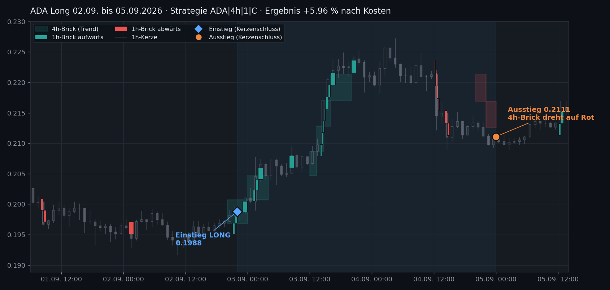
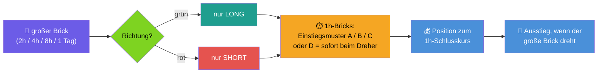
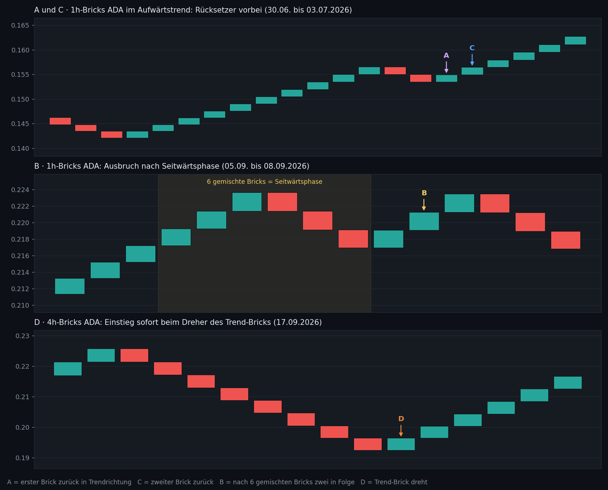
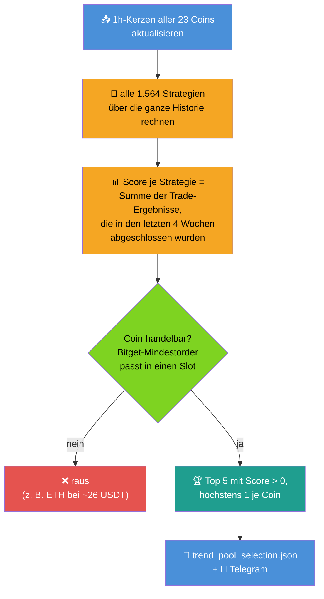
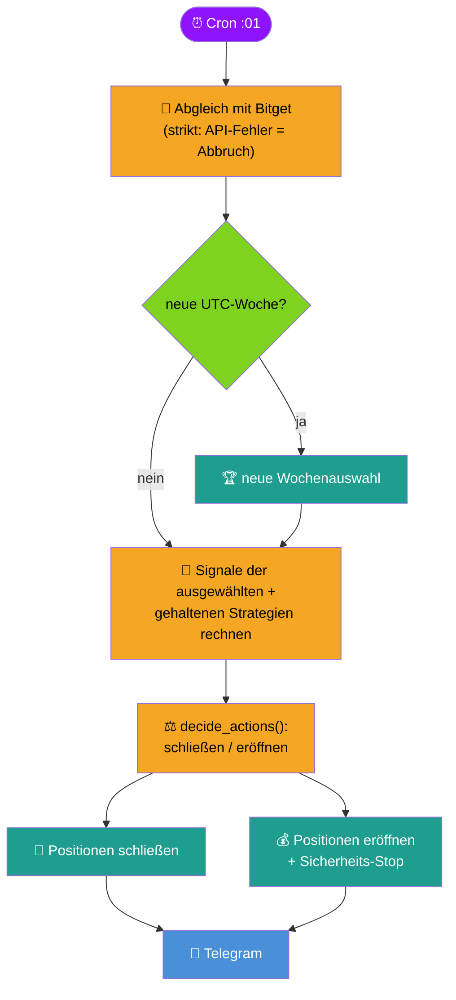

# oraclebot — Trend-Pool


oraclebot handelt Trends mit Renko-Bricks auf zwei Ebenen. Große Bricks geben die Trendrichtung vor, kleine
1h-Bricks bestimmen den Einstieg. Aus einem Pool von 1.564 solcher Strategien (23 Coins × Zeitrahmen ×
Brick-Größe × Einstiegsart) wählt der Bot jeden Montag die 5 aus, die in den letzten 4 Wochen am besten
gelaufen sind, und handelt nur diese.

> **Ehrlicher Forschungsstand (2026-09-27):** In den Tests vor dem Start hat keine Variante eine über fremde
> Coins und Zeiträume stabile Edge gezeigt. Der Portfolio-Backtest mit 25 USDT (2023-06 bis 2026-09) endet
> mit der aktuellen Einstellung bei 27,83 USDT, aber mit −74 % größtem Rückgang zwischendurch. Der Bot läuft
> auf ausdrücklichen Wunsch trotzdem mit echtem Geld. Details unter [Forschungsstand](#forschungsstand).

---

## Inhalt

- [So entsteht ein Trade](#so-entsteht-ein-trade)
- [Die vier Einstiegsarten](#die-vier-einstiegsarten)
- [Der Pool](#der-pool)
- [Wöchentliche Auswahl](#wöchentliche-auswahl)
- [Stündlicher Live-Lauf](#stündlicher-live-lauf)
- [Live = Backtest](#live--backtest)
- [Positionsgröße und Risiko](#positionsgröße-und-risiko)
- [Forschungsstand](#forschungsstand)
- [Befehlsübersicht](#befehlsübersicht)
- [Installation](#installation)
- [VPS-Betrieb](#vps-betrieb)
- [Einstellungen](#einstellungen)
- [Architektur](#architektur)
- [Fallstricke, die schon einmal passiert sind](#fallstricke-die-schon-einmal-passiert-sind)
- [Historie](#historie)

---

## So entsteht ein Trade

Renko-Bricks entstehen nicht nach Zeit, sondern nach Preisbewegung: Ein neuer Brick bildet sich, wenn der
Schlusskurs eine Brick-Größe weiter läuft. Eine Richtungsumkehr braucht zwei Brick-Größen. Die Brick-Größe
passt sich an die Marktunruhe an (EAR: Entropy-Adaptive Renko, `data/ear_bricks.py`).

oraclebot nutzt zwei Ebenen gleichzeitig. Ein echter Trade (ADA, September 2026), gerechnet mit der Signalfunktion
des Bots:



Die großen, transparenten Kästen sind die **4h-Bricks**, die kleinen die **1h-Bricks**, jeweils an der Kerze, deren
Schlusskurs sie erzeugt hat. Der 4h-Trend ist grün, nach einem Rücksetzer auf 1h folgt der Einstieg Long. Der
Ausstieg kommt erst, als der 4h-Brick auf Rot dreht, nicht bei den kleinen roten 1h-Bricks dazwischen. Ein Teil des
Gewinns geht dabei zurück, weil eine Umkehr zwei Brick-Größen braucht.

- **Trend:** die Richtung des letzten großen Bricks (2h, 4h, 8h oder 1 Tag). Grün heißt nur Long, rot nur Short.
- **Einstieg:** auf 1h-Bricks, nur in Trendrichtung (Varianten A, B, C) oder direkt beim Dreher des großen
  Bricks (Variante D).
- **Ausstieg:** sobald der große Brick die Richtung wechselt. Kleine Gegen-Bricks auf 1h werden ignoriert.
- **Preise:** Ein- und Ausstieg immer zum **echten Schlusskurs der 1h-Kerze**, in der das Signal feststeht,
  nie zu einer Brick-Kante (siehe [Historie](#historie), warum das entscheidend ist).


```mermaid
flowchart LR
    T["🧱 großer Brick<br/>(2h / 4h / 8h / 1 Tag)"]:::trend --> R{"Richtung?"}:::dec
    R -- grün --> L["nur LONG"]:::long
    R -- rot --> S["nur SHORT"]:::short
    L --> E["⏱️ 1h-Bricks:<br/>Einstiegsmuster A / B / C<br/>oder D = sofort beim Dreher"]:::proc
    S --> E
    E --> P["💰 Position zum<br/>1h-Schlusskurs"]:::act
    P --> X["🚪 Ausstieg, wenn der<br/>große Brick dreht"]:::act

    classDef trend fill:#6C5CE7,color:#fff
    classDef dec fill:#7ED321,color:#000
    classDef long fill:#1f9e8f,color:#fff
    classDef short fill:#e5534f,color:#fff
    classDef proc fill:#F5A623,color:#000
    classDef act fill:#4A90D9,color:#fff
```

---

## Die vier Einstiegsarten

| Einstieg | Wann der Bot einsteigt |
|---|---|
| **A** | Nach einem Rücksetzer (mind. ein 1h-Brick gegen den Trend) beim **ersten** 1h-Brick zurück in Trendrichtung |
| **C** | Wie A, aber erst beim **zweiten** 1h-Brick zurück in Trendrichtung |
| **B** | Ausbruch: **6 gemischte** 1h-Bricks (Seitwärtsphase), danach **2 in Folge** in Trendrichtung |
| **D** | **Sofort beim Dreher des großen Bricks.** Beim nächsten Dreher raus und direkt in die Gegenrichtung (immer im Markt) |

Alle vier an echten ADA-Bricks:



Bei rotem Trend gilt alles spiegelbildlich für Short.

---

## Der Pool

| | Werte |
|---|---|
| **Coins (23)** | AAVE, ADA, APT, ARB, ATOM, AVAX, BCH, BNB, BTC, DOGE, DOT, ETH, FIL, INJ, LINK, LTC, NEAR, OP, SOL, SUI, TRX, UNI, XRP |
| **Trend-Bricks für A/B/C** | 2h, 4h, 8h, 1 Tag |
| **Trend-Bricks für D** | 1h, 2h, 4h, 8h, 1 Tag |
| **Brick-Größe** | x1, x1,5, x2, x3 (relativ zur Grundgröße des Coins) |
| **Strategien je Coin** | 4 × 4 × 3 (A/B/C) + 5 × 4 (D) = **68** |
| **Pool gesamt** | 23 × 68 = **1.564** |

Eine Strategie heißt z. B. `APT|1D|3|B`: Coin APT, Trend-Bricks auf 1 Tag, Brick-Größe x3, Einstieg B.

Die Grundgröße der Bricks ist je Coin fest in `settings.json` hinterlegt (`base_pct_1h_by_coin`). Sie wurde so
kalibriert, dass alle Coins ungefähr gleich oft Bricks bilden. Die Werte sind bewusst ungerundet: Renko-Ketten
sind pfadabhängig, schon eine Rundung in der 7. Stelle verändert spätere Trades.

---

## Wöchentliche Auswahl

Jeden Montag 00:01 UTC (automatisch durch den ersten stündlichen Lauf der neuen Woche):


```mermaid
flowchart TD
    A["📥 1h-Kerzen aller 23 Coins<br/>aktualisieren"]:::io --> B["🧮 alle 1.564 Strategien<br/>über die ganze Historie rechnen"]:::proc
    B --> C["📊 Score je Strategie =<br/>Summe der Trade-Ergebnisse,<br/>die in den letzten 4 Wochen<br/>abgeschlossen wurden"]:::proc
    C --> D{"Coin handelbar?<br/>Bitget-Mindestorder<br/>passt in einen Slot"}:::dec
    D -- nein --> Z["❌ raus<br/>(z. B. ETH bei ~26 USDT)"]:::no
    D -- ja --> E["🏆 Top 5 mit Score > 0,<br/>höchstens 1 je Coin"]:::act
    E --> F["💾 trend_pool_selection.json<br/>+ 📲 Telegram"]:::io

    classDef io fill:#4A90D9,color:#fff
    classDef proc fill:#F5A623,color:#000
    classDef dec fill:#7ED321,color:#000
    classDef act fill:#1f9e8f,color:#fff
    classDef no fill:#e5534f,color:#fff
```

- Nur **abgeschlossene** Trades vor Montag 00:00 UTC zählen. Das ist dieselbe Information, die auch der
  Backtest zu diesem Zeitpunkt hätte.
- Eine abgewählte Strategie behält ihre offene Position bis zu deren eigenem Ausstieg, eröffnet aber keine neue.
- Die ausgewählten Strategien eröffnen nur Trades, die **in dieser Woche beginnen**. Ein Trend, der schon vor
  Montag lief, wird nicht nachträglich betreten.

---

## Stündlicher Live-Lauf

`scripts/trend_pool_live.py`, jede Stunde in Minute 1:


```mermaid
flowchart TD
    S(["⏰ Cron :01"]):::cron --> R["🔄 Abgleich mit Bitget<br/>(strikt: API-Fehler = Abbruch)"]:::proc
    R --> W{"neue UTC-Woche?"}:::dec
    W -- ja --> SEL["🏆 neue Wochenauswahl"]:::act
    W -- nein --> SIG
    SEL --> SIG["🧮 Signale der ausgewählten +<br/>gehaltenen Strategien rechnen"]:::proc
    SIG --> DEC["⚖️ decide_actions():<br/>schließen / eröffnen"]:::proc
    DEC --> C["🚪 Positionen schließen"]:::act
    DEC --> O["💰 Positionen eröffnen<br/>+ Sicherheits-Stop"]:::act
    C --> TG["📲 Telegram"]:::io
    O --> TG

    classDef cron fill:#9013FE,color:#fff
    classDef dec fill:#7ED321,color:#000
    classDef proc fill:#F5A623,color:#000
    classDef act fill:#1f9e8f,color:#fff
    classDef no fill:#e5534f,color:#fff
    classDef io fill:#4A90D9,color:#fff
```

Ist eine Position an der Börse nicht mehr offen (Sicherheits-Stop, manuell geschlossen), wird sie aus dem
Zustand entfernt und derselbe Trade nicht erneut eröffnet. Positionen auf Pool-Coins, die nicht vom Bot
stammen, werden nicht angefasst; der Coin wird dann übersprungen.

---

## Live = Backtest

Die wichtigste Regel dieses Bots: Backtest und Live dürfen nicht auseinanderlaufen können.

| Baustein | Datei | Genutzt von |
|---|---|---|
| Signale (Trades einer Strategie) | `strategy/trend_pool.py` | Backtest, Portfolio-Simulation, Wochenauswahl, Live |
| Wochenauswahl | `strategy/trend_pool_select.py` | Portfolio-Simulation, Live |
| Ein-/Ausstiegsentscheidung | `strategy/trend_pool_decide.py` | Portfolio-Simulation, Live |
| 1h-Kerzen | `utils/ohlcv_cache.py` | alles |

- **Eine Kette ab festem Start:** Live baut die Brick-Kette jede Stunde komplett neu, immer ab
  `anchor = 2023-01-01`, aus einem Cache, der nur wächst und nie überschrieben wird. Renko-Ketten sind
  pfadabhängig; so sieht Live exakt dieselbe Kette wie der Backtest.
- **Nur abgeschlossene Kerzen:** Die laufende Kerze kommt nie in den Cache, und der große Trend-Brick
  berücksichtigt nur bereits geschlossene Kerzen seines Zeitrahmens.
- **Getestet:** `tests/test_trend_pool.py` rechnet die Signale auf abgeschnittener Historie (so wie Live zu
  jeder Stunde) und prüft, dass sie exakt dem vollen Backtest bis zu diesem Zeitpunkt entsprechen. Ein
  zweiter Test prüft, dass jeder Fill ein echter Kerzenschlusskurs ist.
- **Reproduziert:** Das Modul ergibt für 1.560 der 1.564 Forschungs-Strategien Trade für Trade dieselben
  Ergebnisse wie die Forschungsskripte. Die übrigen 4 weichen um je einen Trade ab (fehlende 1h-Kerze genau an
  einer Zeitrahmen-Grenze); dort gilt das Modul, weil es sich wie Live verhält.

---

## Positionsgröße und Risiko

```
Slot-Marge   = Gesamtkapital / top_k            26 USDT / 5  ≈ 5,2 USDT
Positionsgröße = Slot-Marge × Hebel             5,2 × 3     ≈ 15,7 USDT
Sicherheits-Stop = 25 % Gegenlauf               (Liquidation bei 3x erst bei ~33 %)
```

| Regel | Wert |
|---|---|
| Hebel | 3x, isolated |
| Positionen je Coin | höchstens 1 |
| Sicherheits-Stop | 25 % gegen die Position, als Bitget-Trigger (nur Notbremse; regulärer Ausstieg ist der Trend-Dreher) |
| Mindestorder | Coins, deren Bitget-Mindestorder größer ist als ein Slot, werden bei der Auswahl übersprungen |
| Zu wenig Kapital | Liegt ein Slot unter 5 USDT (bei Top 5 unter ~8,3 USDT Kapital), kann der Bot nicht mehr handeln |

Die Grenze ist real: Im Backtest blieb die Einstellung Top 10 ab Ende 2024 stehen, weil das Kapital unter die
Schwelle fiel. Deshalb läuft der Bot mit Top 5.

---

## Forschungsstand

Alle Zahlen aus den Tests vom 2026-09-27, mit echten Kerzenschlusskursen, Gebühren, Slippage und Funding.

**Portfolio-Backtest mit 25 USDT, 2023-06 bis 2026-09**, mit denselben Funktionen wie Live
(`scripts/trend_pool_backtest.py`):

| Rückblick | Top | Hebel | Endkapital | größter Rückgang | Bemerkung |
|---|---|---|---|---|---|
| **4 Wochen** | **5** | **3x** | **27,83 USDT** | **−74 %** | **aktive Einstellung** |
| 4 Wochen | 10 | 3x | 15,78 USDT | −49 % | handelt ab Ende 2024 nicht mehr |
| 4 Wochen | 10 | 5x | 7,64 USDT | −78 % | |
| 4 Wochen | 3 | 3x | 3,83 USDT | −92 % | |
| 2 Wochen | 10 | 3x | 15,71 USDT | −41 % | stoppt früh |
| 26 Wochen | 10 | 3x | 14,13 USDT | −43 % | stoppt früh |

**Was die Einzeltests gezeigt haben:**

- Die Strategien verdienen in starken Trendphasen und verlieren in Seitwärtsphasen. Über 23 Coins und
  2023–2026 liegen die besten Varianten nach Kosten bei etwa ±0 % pro Trade.
- Auf den 7 ursprünglichen oraclebot-Coins sahen fast alle Varianten positiv aus, auf 16 anderen Coins fast
  alle negativ. Das ist ein Effekt der Coin-Auswahl, keine Edge der Regel.
- Auswahl nach den letzten Wochen: 26 und 2 Wochen Rückblick negativ, 4 Wochen positiv, aber statistisch
  nicht belastbar. Auswahl nach Trendstärke war schlechter als der Durchschnitt.
- Eine Suche nach „20 bestätigten Strategien“ mit weggelegtem Test fand im Kern einen einzigen trendenden Coin
  (UNI); ohne ihn lag das Ergebnis leicht im Minus.

Das Einsatzrisiko ist also hoch. Beobachte die ersten Wochen genau und vergleiche die echten Trades mit dem
Backtest (`scripts/trend_pool_backtest.py`).

---

## Befehlsübersicht

Alle Befehle im `oraclebot`-Verzeichnis, auf dem VPS mit `.venv/bin/python3`.

| Befehl | Zweck |
|---|---|
| `.venv/bin/python3 scripts/trend_pool_live.py` | Stündlicher Lauf (normalerweise per Cron) |
| `.venv/bin/python3 scripts/trend_pool_live.py --dry-run` | Anzeigen, was der Bot jetzt tun würde, **keine Orders** |
| `.venv/bin/python3 scripts/trend_pool_weekly.py` | Wochenauswahl manuell erstellen + per Telegram schicken |
| `.venv/bin/python3 scripts/trend_pool_weekly.py --dry-run` | Wochenauswahl nur anzeigen |
| `.venv/bin/python3 scripts/trend_pool_backtest.py --no-fetch --top-k 5` | Portfolio-Backtest (Optionen: `--start`, `--equity`, `--lookback`, `--leverage`) |
| `./run_tests.sh` | Testsuite |
| `tail -f logs/trend_pool_live.log` | Live-Log mitverfolgen |
| `cat artifacts/state/trend_pool_selection.json` | Aktuelle Wochenauswahl |
| `cat artifacts/state/trend_pool_positions.json` | Offene Positionen des Bots |
| `./update.sh` | Neueste Version holen (sichert `secret.json`) |

---

## Installation

```bash
git clone https://github.com/Youra82/oraclebot.git
cd oraclebot
bash ./install.sh
cp secret.json.example secret.json
nano secret.json
```

```json
{
    "oraclebot": [
        { "name": "Main-Account", "apiKey": "DEIN_API_KEY", "secret": "DEIN_SECRET", "password": "DEIN_PASSPHRASE" }
    ],
    "telegram": { "bot_token": "DEIN_BOT_TOKEN", "chat_id": "DEINE_CHAT_ID" }
}
```

Der erste Lauf lädt die 1h-Kerzen aller 23 Coins ab 2023-01-01 (etwa 20–30 Minuten). Danach kommen pro Stunde
nur die neuen Kerzen dazu.

```bash
.venv/bin/python3 scripts/trend_pool_weekly.py            # erster Download + erste Auswahl
.venv/bin/python3 scripts/trend_pool_live.py --dry-run    # Kontrolle
```

Im Log muss bei jedem Coin `Luecken im Cache 0` stehen. ARB, INJ und SUI zeigen einige „leere Fenster“: Das
ist die Zeit vor ihrem Listing.

---

## VPS-Betrieb

Ein einziger Cronjob, im Stil der anderen Bots mit `flock`:

```cron
# oracleBot  -> Minute 1 (kollidiert nicht mit den */15-Laeufen der anderen Bots)
1 * * * * /usr/bin/flock -n /home/matola/oraclebot/oraclebot.lock /bin/sh -c "OMP_NUM_THREADS=1 MKL_NUM_THREADS=1 cd /home/matola/oraclebot && /home/matola/oraclebot/.venv/bin/python3 scripts/trend_pool_live.py >> /home/matola/oraclebot/logs/trend_pool_live.log 2>&1"
```

- Minute 1: Die 1h-Kerze ist geschlossen.
- Montags um 00:01 UTC dauert der Lauf einige Minuten länger, weil er die Wochenauswahl über alle 1.564
  Strategien rechnet. Der Zeitpunkt richtet sich nach UTC, nicht nach der Zeitzone des Servers.
- **Bot stoppen:** Cron-Zeile auskommentieren. Offene Positionen bleiben dann stehen (mit Sicherheits-Stop)
  und müssen auf Bitget manuell geschlossen werden.
- **Pausieren ohne Stopp:** `trend_pool_settings.enabled` auf `false`, pushen, `./update.sh`.

---

## Einstellungen

`settings.json` → `trend_pool_settings`:

| Schlüssel | Wert | Bedeutung |
|---|---|---|
| `enabled` | `true` | Hauptschalter |
| `coins` | 23 Coins | Pool-Coins |
| `anchor` | `2023-01-01` | Startpunkt der Brick-Ketten (nicht ändern, sonst neue Ketten) |
| `base_pct_1h_by_coin` | je Coin | Grundgröße der 1h-Bricks (ungerundet) |
| `htf_abc` / `htf_d` | `2h,4h,8h,1D` / `1h,2h,4h,8h,1D` | Trend-Zeitrahmen je Einstiegsart |
| `mults` | `1, 1.5, 2, 3` | Brick-Größen der Trend-Ebene |
| `entries_abc`, `include_d` | `A,B,C`, `true` | Einstiegsarten |
| `horizontal_lookback`, `breakout_run` | `6`, `2` | Muster für Einstieg B |
| `lookback_weeks` | `4` | Rückblick der Wochenauswahl |
| `top_k` | `5` | Anzahl gleichzeitig ausgewählter Strategien = Anzahl Slots |
| `max_per_coin` | `1` | höchstens eine Strategie je Coin |
| `leverage`, `margin_mode` | `3`, `isolated` | Hebel |
| `safety_stop_pct` | `25` | Notbremse in % Gegenlauf |
| `entry_grace_hours` | `2` | Einstieg wird bis zu 2 Stunden nachgeholt, falls ein Lauf ausfiel |
| `cost_pct`, `funding_pct_8h` | `0.16`, `0.01` | Kostenannahmen des Backtests |


---

## Architektur

```
scripts/
├── trend_pool_live.py        Stündlicher Live-Lauf (einziger Cronjob)
├── trend_pool_weekly.py      Wochenauswahl (wird vom Live-Lauf automatisch aufgerufen, manuell nutzbar)
└── trend_pool_backtest.py    Portfolio-Backtest mit den Live-Funktionen
src/oraclebot/
├── strategy/
│   ├── trend_pool.py         Signalfunktion: Bricks beider Ebenen, Einstiege A/B/C/D, Trades
│   ├── trend_pool_select.py  Wochenauswahl (Score, Top-K, max. 1 je Coin)
│   └── trend_pool_decide.py  Ein-/Ausstiegsentscheidung je Stunde
├── analysis/
│   └── trend_pool_portfolio.py  Portfolio-Simulation mit Kapital, Hebel, Mindestorder, Sicherheits-Stop
├── data/ear_bricks.py        EAR-Brick-Konstruktion (Entropie-adaptive Brick-Größe)
└── utils/
    ├── ohlcv_cache.py        Append-only 1h-Cache über Bitgets history-candles-Endpunkt
    ├── exchange.py           Bitget-Wrapper (inkl. strikter Positionsabfrage, Gesamtkapital)
    ├── telegram.py           Benachrichtigungen
    └── config.py             settings.json laden
docs/img/                              Abbildungen dieses README (aus echten Daten erzeugt)
artifacts/
├── datasets/trend_1h_<COIN>.pkl       1h-Cache (nicht in Git)
└── state/trend_pool_*.json            Wochenauswahl, Positionen (nicht in Git)
```

---

## Fallstricke, die schon einmal passiert sind

- **Brick-Kanten sind keine handelbaren Preise.** Die frühere Renko-Strategie sah im Backtest stark aus, weil
  sie zu Brick-Kanten füllte. Real steht ein Brick erst beim Kerzenschluss fest, dann ist der Kurs schon
  weiter. Beim Einstieg kostete das im Median ½ Brick, beim Ausstieg 1½ Bricks, und damit war die ganze Edge
  weg. Hier wird deshalb ausschließlich zum Kerzenschlusskurs gerechnet.
- **Die gepinnte ccxt-Version liefert Lücken.** `ccxt==4.3.5` gab bei Bitget für Startzeitpunkte zwischen
  09.07. und 30.07.2026 immer leere Antworten; der erste Cache verlor dadurch 600 Kerzen je Coin, und die
  Wochenauswahl auf dem VPS wich ab. `ohlcv_cache.py` fragt deshalb Bitgets `history-candles` direkt mit
  festen 200-Stunden-Fenstern ab. Dessen `endTime` lässt die letzte Kerze weg, daher endet jede Anfrage bei
  der Öffnung der nächsten Kerze. Datenabrufe immer gegen die Version aus `requirements.txt` testen.
- **Verschluckte API-Fehler lassen Positionen verwaisen.** `fetch_open_positions()` gibt bei Fehlern `[]`
  zurück; eine echte Position sähe dann „geschlossen“ aus und bekäme keinen Ausstieg mehr (bei mbot führte
  dasselbe Muster zu einer Liquidation). Der Trend-Pool nutzt `fetch_open_positions_strict()`, das bei Fehlern
  abbricht.
- **Zwei Bots auf einem Konto stören sich.** Die frühere Renko-Engine hätte beim Abgleich fremde Positionen auf
  ihren Coins übernommen und nach eigenen Signalen geschlossen. Deshalb wurde sie vor dem Start des Trend-Pools
  komplett gestoppt und entfernt. Der Trend-Pool selbst fasst Positionen, die nicht von ihm stammen, nie an.
- **Rundung verändert Renko-Ketten.** Schon auf 6 Stellen gerundete Brick-Größen ergaben andere Trades.
  Brick-Parameter immer ungerundet speichern.

---

## Historie

| Zeitraum | Strategie | Ergebnis |
|---|---|---|
| bis 2026-09-22 | 4h-Barriere-Vorhersage (BTC, Gradient Boosting) | nach Lookahead-Fix keine Edge, Code entfernt |
| 2026-09-21 bis 09-27 | Renko-Breakout auf 5m-Bricks, 7 Coins, Echtzeit per WebSocket | Backtest-Gewinn war Brick-Preis-Illusion; live 23 % Winrate, stillgelegt |
| seit 2026-09-27 | **Trend-Pool** (dieses README) | live seit 2026-09-27 |

Der Code der früheren Strategien wurde entfernt; er ist in der Git-Historie erhalten (letzter Stand der
Renko-Echtzeit-Engine: Commit `ec9a826`).

---

## Troubleshooting

**`update.sh` fragt nach Benutzername/Passwort:** Die Remote-URL steht auf HTTPS.

```bash
git remote set-url origin git@github.com:Youra82/oraclebot.git
ssh -T git@github.com   # erwartet: "Hi Youra82! You've successfully authenticated..."
```

**Log zeigt `Cache endet bei … nicht handeln`:** Bitget lieferte die letzten Stunden nicht. Der Lauf handelt
dann bewusst nicht und versucht es in der nächsten Stunde erneut.

---

## Abhängigkeiten

```
ccxt==4.3.5        # Bitget (Kerzen über den rohen history-candles-Endpunkt, siehe Fallstricke)
pandas==2.3.3
numpy==2.3.5
requests           # Telegram
pytest
```
